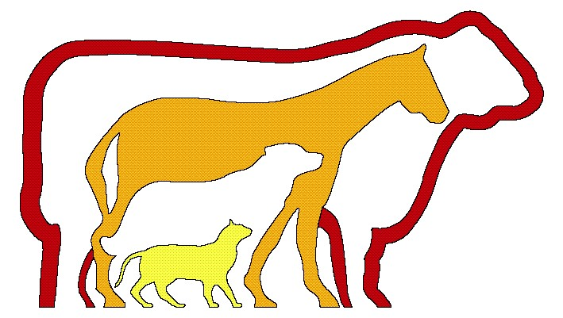

::: {style="text-align:center; margin-bottom:40px;"}


<h1 style="margin:0; font-size:2rem;">

Monthly Herd Health Report

</h1>

<h2 style="margin:5px 0 0 0; font-weight:normal;">

MMW Dairy

</h2>

<h3 style="margin:5px 0 0 0; font-weight:normal; font-size:1rem;">

<a href="https://www.animalclinicfortlupton.com" style="text-decoration:none; color:inherit;"> Animal Clinic LLC </a> \| `r Sys.Date()`

</h3>
:::

```{r}
#| label: setup packages and read in data
#| include: false

if (!require("pacman")) install.packages("pacman")
pacman::p_load(
  tidyverse,
  dtplyr,
  gt,
  arrow,
  rmarkdown,
  lubridate,
  quarto, 
  arrow,
  zoo,
  knitr,
  glue
  )

# data you will need for this report
events_formatted <- read_parquet('../data/intermediate_files/events_formatted.parquet')

animals <- read_parquet('../data/intermediate_files/animals.parquet')

pull_date <- unique(animals$data_pull_date_max)

date_start <- pull_date - 365 # pulls last year of data, modify for specific project

date_end <- pull_date

```

```{r}
#| label: set up df's
#| include: false

lame_events <- events_formatted |> 
  filter(event %in% c("LAME", "TRIM"))

mastitis_events <- events_formatted |> 
  filter(event %in% c("MAST", "CULTURE"))

repro_data <- events_formatted %>%
  filter(event_type %in% c("repro"))%>%
  select(id_animal, id_animal_lact, date_birth, lact_number, event, date_event, dim_event, R)

vwp <- 50 # Set to herd's VWP

youngstock_data <- events_formatted%>%
  filter(lact_number == 0)
```

```{r}
#| label: denominators
#| include: false

denom_path <- "../data/intermediate_files/denominator_by_lact_group_time_period365.parquet"

if (!file.exists(denom_path)) {
  quarto::quarto_render(
    input = "../step3_denominators_by_lactation_group.qmd",
    execute_dir = dirname("../step3_denominators_by_lactation_group.qmd"),
    execute_params = list(
      denominator_granularity = 365,
      cut_by_days = 30,
      top_cut = 400,
      top_cut_hfr = 500
    ),
    output_format = "null"
  )
}

deno365 <- read_parquet(denom_path)

```

# Lameness Assessment:

```{r}
#| label: lameness count
#| echo: false
#| results: asis

lame_events <- lame_events %>%
  filter(date_event > (date_end - years(1)) & date_event <= date_end)

lame_count <- nrow(lame_events)

# Print sentence with correct singular/plural
if (lame_count == 1) {
  cat("In the past year there was 1 lame event.\n")
} else {
  cat(glue("In the past year there were {lame_count} lame events.\n"))
}
```

```{r}
#| label: lameness events by lactgp
#| echo: false

lame_by_lact <- lame_events %>%
  filter(date_event > (date_end - years(1)) & date_event <= date_end) %>%
  count(lact_group, name = "lame_events")

lame_by_lact %>%
  mutate(
    sentence = glue::glue("Lact group {lact_group}: {lame_events} lame event(s)")
  ) %>%
  pull(sentence) %>%
  cat(sep = "\n")

```

```{r}
#| label: Lame over DIM
#| echo: false

lame_data <- lame_events %>% 
  filter(is.na(date_archived)|date_archived > date_start) %>% 
  filter(dim_event >=0)

ggplot(lame_data, aes(x = dim_event)) +
  geom_histogram(binwidth = 10, fill = "steelblue", color = "black", alpha = 0.7) +
  theme_minimal(base_size = 14) +
  labs(
    title = "Distribution of Lameness Events Over Days in Milk",
    x = "Days in Milk",
    y = "Count"
  ) +
  theme(
    panel.grid.major = element_line(color = "gray80"),
    panel.grid.minor = element_blank(),
    strip.text = element_text(size = 14, face = "bold")
  )

```

```{r}
#| fig-height: 8
#| label: lame event types
#| echo: false

summarize_lame_events<-lame_data |> 
  group_by(event, protocols_remaining_after_numbers1) |> 
  summarize(count_rows=sum(n()))|>
  ungroup()%>%
  mutate(event_type = factor(protocols_remaining_after_numbers1), 
         Event = factor(event),
         event_type = if_else(is.na(event_type), "Trim Only", event_type))

facet_order <- summarize_lame_events %>%
  group_by(event_type) %>%
  summarise(n_y = n_distinct(event)) %>%
  arrange(desc(n_y)) %>%  # Order by most y categories
  pull(event_type)

# order events
summarize_lame_events <- summarize_lame_events %>%
  mutate(event_type = fct_reorder(event_type, count_rows, .fun = sum, .desc = FALSE)) 

  ggplot(summarize_lame_events)+
  geom_bar(aes(x = event_type,
               y = count_rows, fill = event_type), stat = "identity")+
  #facet_wrap(factor(event, levels = facet_order) ~., scales = 'free')+
    facet_wrap(vars(event), ncol = 1, scales = "free")+
  coord_flip()+
  scale_fill_viridis_d()+
  theme_minimal()+
  labs(x = "",
       y = "Row Count")+
  theme(legend.position = "none",
        # axis.text.y = element_text(size = 6)
  )
```

```{r}
#| label: top 5 lame by dim
#| echo: false

summarized_lame_events <- lame_data |>
  mutate(
    dim_event = as.numeric(dim_event),
    dim_30 = floor(dim_event / 30) * 30,
    event_type = if_else(
      is.na(protocols_remaining_after_numbers1),
      "Trim Only",
      as.character(protocols_remaining_after_numbers1)
    )
  ) |>
  group_by(dim_30, event, event_type) |>
  summarise(count_rows = n(), .groups = "drop") |>
  mutate(
    event = factor(event),
    event_type = factor(event_type)
  )

# Identify top 5 event types
top_5_events <- summarized_lame_events |>
  group_by(event_type) |>
  summarise(total_count = sum(count_rows), .groups = "drop") |>
  arrange(desc(total_count)) |>
  slice_head(n = 5) |>
  pull(event_type)

# Filter to top 5
summarized_lame_events <- summarized_lame_events |>
  filter(event_type %in% top_5_events)

# Plot
ggplot(summarized_lame_events, aes(x = dim_30, y = count_rows, fill = event_type)) +
  geom_col(width = 14) +
  scale_fill_viridis_d() +
  scale_x_continuous(
    breaks = seq(0, max(summarized_lame_events$dim_30), by = 90)
  ) +
  theme_minimal(base_size = 14) +
  facet_wrap(vars(event_type), ncol = 3, scales = "free_y") +
  labs(
    title = "Stacked Bar Graph of Lameness Events by Days in Milk",
    x = "Days in Milk",
    y = "Count of Events",
    fill = "Event Type"
  ) +
  theme(
    axis.text.x = element_text(angle = 90, hjust = 1),
    panel.grid.major = element_line(color = "gray80", size = 0.3),
    panel.grid.minor = element_blank(),
    strip.text = element_text(size = 14, face = "bold"),
    legend.position = "right"
  )
```

```{r}
#| label: lame by month
#| echo: false

monthly_lame_events <- lame_data |>
  mutate(
    date_event = as.Date(date_event),
    month = floor_date(date_event, "month")
  ) |>
  group_by(month, protocols_remaining_after_numbers1) |>
  summarise(count_rows = n(), .groups = "drop") |>
  mutate(
    event_type = if_else(
      is.na(protocols_remaining_after_numbers1),
      "Trim Only",
      as.character(protocols_remaining_after_numbers1)
    ),
    event_type = factor(event_type)
  )

top_5_monthly <- monthly_lame_events |>
  group_by(event_type) |>
  summarise(total_count = sum(count_rows), .groups = "drop") |>
  arrange(desc(total_count)) |>
  slice_head(n = 5) |>
  pull(event_type)

monthly_lame_events <- monthly_lame_events |>
  filter(event_type %in% top_5_monthly)

ggplot(monthly_lame_events, aes(x = month, y = count_rows, fill = event_type)) +
  geom_col() +
  scale_fill_viridis_d() +
scale_x_date(
  date_breaks = "3 months",
  date_labels = "%b %Y",
  limits = c(min(monthly_lame_events$month), date_end)
  ) +
  theme_minimal(base_size = 14) +
  labs(
    title = "Top 5 Lameness Events by Month",
    x = "Month",
    y = "Number of Events",
    fill = "Event Type"
  ) +
  theme(
    axis.text.x = element_text(angle = 45, hjust = 1),
    legend.position = "right"
  )

```
