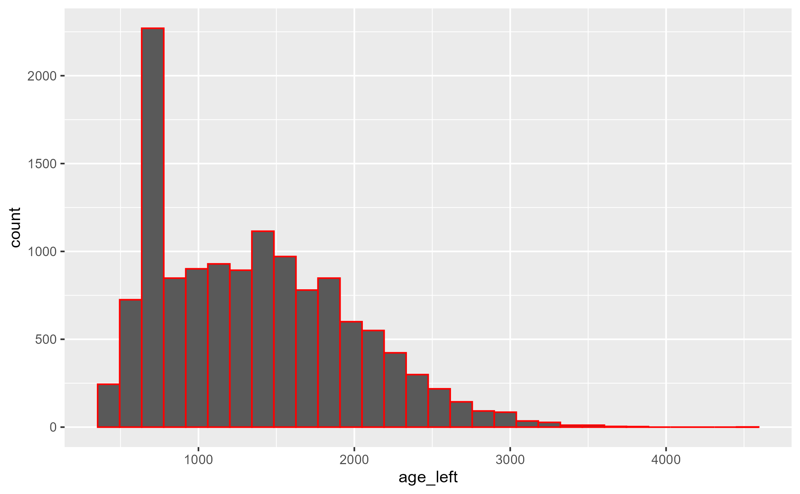

```{r}
#| label: setup
#| include: false
knitr::opts_chunk$set(echo = TRUE)

# Load your packages here

library(tidyverse) #this includes many packages and is the main package used in nearly all data wrangling
library(arrow) #this package handles parquet files
library(skimr) #this is particularly helpful when looking at new data or finding NA values
library(waldo) #we use this to create answer keys for these exercises


```

## Read and Visualize

In this milestone, you'll use ggplot2 to visualize the distribution of age_left for a subset of the data. But before you begin, you'll need to import the animals data set. Unlike with Milestone 1, the animals data set has not been pre-loaded for you to use in R.


## Recreation

### Part 1 - Import

In the code chunk below, use a command from the arrow package to read in the animals data set.

* The animals data set lives in the file `animals.parquet` (think of parquet as just another file extension like .csv, or .doc), which is stored in the `data/intermediate_files` folder in your working directory.  However, this quarto document lives in a folder below the working directory, so when you call the file path you need to use "../" at the beginning of the path to tell it to look for the path beginning one level higher than where this quarto document is stored. 

* Save the data set as an object in your environment named `animals`.


```{r}
#| label: recreation-import
#hint the function to read in a parquet file is the same as the code to read a csv file except replace 'csv' with 'parquet'

# "C:\GitHub\2025_fall_posit_course\data\intermediate_files\animals.parquet"
# "C:\GitHub\2025_fall_posit_course\milestones_dairy\milestone_week_02_quarto_visualize_mark.qmd"
animals <- read_parquet("../data/intermediate_files/animals.parquet")
skim(animals)
animals
# write_csv(animals,"excel_excuses.csv")
view(animals)

```

### Part 2 - Visualize

Run the code chunk below to see a plot. Your task is to recreate this plot. 


```{r}
#| label: recreate-this
#| message: false


```

Use `ggplot()` in the chunk below to re-create the plot above. Before plotting, you will first need to filter your data set to only include observations from cattle where age_left is more than 1 year.


```{r}
#| label: recreation-visualize
animals365 <- animals %>%
  filter(age_left > 365)
view(animals365)
# write_csv(animals365,"excel_excuses.csv")

# Verify removal of instances 365 or less
# Verify removal of NA entries

#ggplot(animals %>% filter(age_left > 365), mapping = aes(x = age_left)) +

ggplot(animals365, mapping = aes(x = age_left)) +
  geom_histogram(binwidth = 158, color = "red") +
  scale_x_continuous(
    name = "Age Left (days)", 
      # Change the axis title
    breaks = seq(0, 5000, by = 500),
      # Define specific tick mark locations
    labels = c("0", "500", "1000", "1500", "2000", "2500", "3000", "3500", "4000", "4500", "5000"),
      # Provide custom labels for breaks
    limits = c(0, 5000)
      # Set the minimum and maximum values displayed on the axis
  )


```


## Extension

Using the code chunk below, investigate a research question about this data, using the visualization skills you learned this week. Some ideas:

1. How does the distribution of age_left differ between breeds? Consider exploring these distributions with other geoms.
2. What relationships do you see between age_left and other variables of interest in the data set?
3. [any other research question of interest]

Alternately, working with a data set of your own, complete the following: 

1. Read in your data
2. Filter your data using a logical test/condition 
3. Graph this data subset using at least one geom 


```{r}
#| label: extension
ggplot(data = animals365, mapping = aes(x = date_birth, y = age_left)) +
  geom_point(color = "lightblue")

# fracture the scatterplot by breed
ggplot(data = animals365, aes(x = date_left, y = age_left, color = factor(breed))) +
  geom_point() +
  scale_color_manual(values = c("H" = "black", "J" = "orange", "A" = "red", "X" = "green"))

# select only the Holstein cattle
ggplot(
  animals365 %>% filter(breed == "H"
    ), aes(x = date_left, y = age_left, color = factor(breed))) +
  geom_point() +
  scale_color_manual(values = c("H" = "black", "H,X" = "orange", "A" = "red", "X" = "green"))

# select only the Jersey cattle
ggplot(
  animals365 %>% filter(breed == "H,X"
    ), aes(x = date_left, y = age_left, color = factor(breed))) +
  geom_point() +
  scale_color_manual(values = c("H" = "black", "H,X" = "orange", "A" = "red", "X" = "green"))

# select only the Angus cattle
ggplot(
  animals365 %>% filter(breed == "A"
    ), aes(x = date_left, y = age_left, color = factor(breed))) +
  geom_point() +
  scale_color_manual(values = c("H" = "black", "H,X" = "orange", "A" = "red", "X" = "green"))

# select only the Cross cattle
ggplot(
  animals365 %>% filter(breed == "X"
    ), aes(x = date_left, y = age_left, color = factor(breed))) +
  geom_point() +
  scale_color_manual(values = c("H" = "black", "J" = "orange", "A" = "red", "X" = "green"))

# Basic jitter plot
ggplot(animals365 %>% filter(breed == "H"), aes(x = date_left, y = age_left)) +
  geom_jitter() +
  scale_color_manual(values = c("H" = "black", "J" = "orange", "A" = "red", "X" = "green"))

# Multiple histograms by breed category
ggplot(animals365, aes(age_left)) +
  geom_histogram(binwidth = 158, color = "blue", fill = "skyblue") +
  facet_wrap("breed") +
  labs(title = "Histograms by Category", x = "Value", y = "Frequency") +
  theme_minimal()

#Trial Violin Plot
ggplot(data = animals365, aes(x = date_left, y = age_left, fill = age_left)) +
  geom_violin(color = "blue", fill = "skyblue") +
  coord_flip() +
  labs(title = "Age Left (days)",
           x = "Date Left",
           y = "Age Left") +
      theme_minimal() # Apply a minimal theme

## Box & Whisker
ggplot(animals365, aes(x = age_left, y = breed)) +
    geom_jitter(color="blue", alpha=0.4,size=1)+
  geom_boxplot(fill = "gray", color = "black", alpha=0.7 
              # outlier.color=NA 
              )+
labs(title = "Age Left by Breed",
       x = "Removal Age",
       y = "Breed")
```

