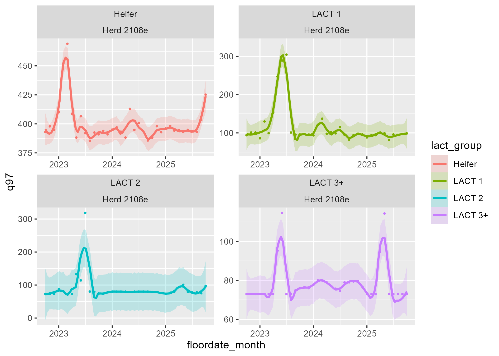

```{r}
#| label: setup
#| include: false
knitr::opts_chunk$set(echo = TRUE)

# This chunck is already finished for you, you don't need to modify anything here
library(tidyverse) #this includes many packages and is the main package used in nearly all data wrangling
library(arrow) #this package handles parquet files
library(skimr) #this is particularly helpful when looking at new data or finding NA values
library(waldo) #we use this to create answer keys for these exercises


#add some extra functions
source('data_milestones/fxn_floor_dates.R')


```

## Summarize data

In this milestone you'll create, visualize, and compare summary statistics for the animals included in the data set.

## Recreation

### Part 1 - Import

Before you begin, you will need to import your data set. Use the code chunk below to read the data from the data file **`events_formatted.parquet`**, which is stored in the **`../data/intermediate_files`** folder in your working directory. Be sure to save the data to an object in your environment named **`events_formatted`**.

```{r}
#| label: recreation-import

#add code to read in the events file here
events_formatted <- read_parquet("../data/intermediate_files/events_formatted.parquet") 
|> add_new_variables()

#skim(events_formatted)
# events_formatted
# write_csv(events_formatted,"excel_excuses.csv")


```

### Part 2 - Summarize data

This week, we'd like to see if days in milk (dim_event) at the first bred event (**BRED1**) has changed over time.

We will summarize the data by lactation group (**lact_group**) , location (**location_event**), and month bred (**floordate_month**).

You will learn to write the code to add new variables (like month bred) in a few weeks. For now you can create month bred in the chunk ***above this*** by piping your data to the function ***add_new_variables()***. Note that this function may take a little time to process. This function will also modify the events so that they are numbers and you don't have to do anything special to find all the first breedings other than filter for **BRED1**

Before you move on, run the code chunk below to make sure you see all the grouping variables in your list of variable names. The output of this chunk should be:

"floordate_month" "lact_group" "location_event"

If don't get a green checkmark here, you need to fix the chunk above in part 1 before you move on.

```{r check_variables}

#(Don't worry if you don't understand all the code in this chunk yet...but you probably understand most of it)
check<-tibble(list_columns = colnames(events_formatted))%>%
    filter(list_columns %in% c('location_event', 'lact_group', 'floordate_month'))%>%
    pull(list_columns)%>%
    sort()
check

waldo::compare(check, read_rds('data_milestones/solutions_week_03_check_columns.rds'))
           
```

Now run the code below to see the table you are trying to create.

```{r}
#| label: recreate-this
#| message: false


solution <- readr::read_rds("data_milestones/solutions_week_03_summary_data.rds")
solution

```

Now summarize your data to recreate the table above.

-   Create an object in your environment that is a summary of the data named "dim_at_bred".

-   Limit the time frame we are looking at to 3 years.

-   For each location, lactation group, and month calculate:

<!-- -->

1.  mean

2.  sd

3.  median

4.  min

5.  max

6.  97th percentile (hint: q97 = quantile(dim_event, probs = 0.97) )

***don't forget to filter your data so you are only looking at Bred1 events, for only the past 3 years*****.**

Work in the code chunk below. Save the result as `dim_at_bred`. We will use the result in Part 3.

```{r}
#| label: recreation-summary
#

# events_formatted |>
#   filter(event == "BRED1") |>
#   select(remark,contains("remark"))


dim_at_bred <- events_formatted |>
  filter(event == "BRED1") |>
  filter(date_event >= (max(date_event) - 1095)) |>
  group_by(event, location_event, lact_group, floordate_month) |>
  summarise(
    mean   = mean(dim_event, na.rm = TRUE),
    sd     = sd(dim_event, na.rm = TRUE),
    median = median(dim_event, na.rm = TRUE),
    min    = min(dim_event, na.rm = TRUE),
    max    = max(dim_event, na.rm = TRUE),
    q97    = as.numeric(quantile(dim_event, probs = 0.97, na.rm = TRUE))
  ) |>
  ungroup()
  


```

Run the following code chunk to test whether you have the same answer as the solution:

```{r}
#| label: compare
#| eval: false
waldo::compare(dim_at_bred, solution, tolerance = 1e-4)
```

### Part 3 - Visualize

Let's display our results visually. Run the chunk below to see a plot.

```{r}
#| label: recreate-plot
#| message: false

```

Use the code chunk below to create the plot above. Hint: if your geom_smooth line looks different adjust the span

```{r}
#| label: recreation-plot

library(gridExtra)

# =========================================================
# PLOT OF THE Q97 BRED1
# =========================================================

# Define a named color palette for lines/points
my_colors <- c(
  "Heifer"  = "purple",
  "LACT 1"  = "blue",
  "LACT 2"  = "forestgreen",
  "LACT 3+" = "red"
)

# Define a matching palette for the smooth band fill
my_fills <- c(
  "Heifer"  = "plum",
  "LACT 1"  = "lightblue",
  "LACT 2"  = "lightgreen",
  "LACT 3+" = "tomato"
)

p0 <- dim_at_bred %>% 
  filter(lact_group == "Heifer") %>%
  ggplot(aes(x = floordate_month, y = q97, 
             color = lact_group, fill = lact_group, span = 2)) +
  geom_smooth() + geom_point() +
  ylim(380, 420) +
  labs(title = "Heifer") +
  scale_color_manual(values = my_colors) +
  scale_fill_manual(values = my_fills)

p1 <- dim_at_bred %>% 
  filter(lact_group == "LACT 1") %>%
  ggplot(aes(x = floordate_month, y = q97, 
             color = lact_group, fill = lact_group, span = 2)) +
  geom_smooth() + geom_point() +
  ylim(70, 105) +
  labs(title = "LACT 1") +
  scale_color_manual(values = my_colors) +
  scale_fill_manual(values = my_fills)

p2 <- dim_at_bred %>% 
  filter(lact_group == "LACT 2") %>%
  ggplot(aes(x = floordate_month, y = q97, 
             color = lact_group, fill = lact_group, span = 2)) +
  geom_smooth() + geom_point() +
  ylim(70, 105) +
  labs(title = "LACT 2") +
  scale_color_manual(values = my_colors) +
  scale_fill_manual(values = my_fills)

p3 <- dim_at_bred %>% 
  filter(lact_group == "LACT 3+") %>%
  ggplot(aes(x = floordate_month, y = q97, 
             color = lact_group, fill = lact_group, span = 2)) +
  geom_smooth() + geom_point() +
  ylim(70, 105) +
  labs(title = "LACT 3+") +
  scale_color_manual(values = my_colors) +
  scale_fill_manual(values = my_fills)

grid.arrange(p0, p1, p2, p3, ncol = 2)


# =========================================================
# PLOT OF THE MEDIAN BRED1
# =========================================================

# library(gridExtra)

# Define a named color palette for lines/points
my_colors <- c(
  "Heifer"  = "purple",
  "LACT 1"  = "blue",
  "LACT 2"  = "forestgreen",
  "LACT 3+" = "red"
)

# Define a matching palette for the smooth band fill
my_fills <- c(
  "Heifer"  = "plum",
  "LACT 1"  = "lightblue",
  "LACT 2"  = "lightgreen",
  "LACT 3+" = "tomato"
)

p0 <- dim_at_bred %>% 
  filter(lact_group == "Heifer") %>%
  ggplot(aes(x = floordate_month, y = median, 
             color = lact_group, fill = lact_group, span = 2)) +
  geom_smooth() + geom_point() +
  ylim(355, 400) +
  labs(title = "Heifer") +
  scale_color_manual(values = my_colors) +
  scale_fill_manual(values = my_fills)

p1 <- dim_at_bred %>% 
  filter(lact_group == "LACT 1") %>%
  ggplot(aes(x = floordate_month, y = median, 
             color = lact_group, fill = lact_group, span = 2)) +
  geom_smooth() + geom_point() +
  ylim(65, 80) +
  labs(title = "LACT 1") +
  scale_color_manual(values = my_colors) +
  scale_fill_manual(values = my_fills)

p2 <- dim_at_bred %>% 
  filter(lact_group == "LACT 2") %>%
  ggplot(aes(x = floordate_month, y = median, 
             color = lact_group, fill = lact_group, span = 2)) +
  geom_smooth() + geom_point() +
  ylim(65, 80) +
  labs(title = "LACT 2") +
  scale_color_manual(values = my_colors) +
  scale_fill_manual(values = my_fills)

p3 <- dim_at_bred %>% 
  filter(lact_group == "LACT 3+") %>%
  ggplot(aes(x = floordate_month, y = median, 
             color = lact_group, fill = lact_group, span = 2)) +
  geom_smooth() + geom_point() +
  ylim(65, 80) +
  labs(title = "LACT 3+") +
  scale_color_manual(values = my_colors) +
  scale_fill_manual(values = my_fills)

grid.arrange(p0, p1, p2, p3, ncol = 2)


```

## Extension

Using the code chunk below, investigate a research question about this data, using the data wrangling skills you learned this week.

```{r}

# =========================================================
# LACTATION GROUP BRED1 COUNTS INCLUDING HEIFERS
# =========================================================

# Define a named color palette
my_colors <- c(
  "Heifer"  = "purple",
  "LACT 1"  = "blue",
  "LACT 2"  = "forestgreen",
  "LACT 3+" = "red"
)

bred_inventory <- events_formatted |>
  filter(event == "BRED1") |>
  filter(date_event >= (max(date_event) - 365)) |> 
  group_by(lact_group) |>
  summarise(
    count  = n(),   # number of rows in each lact_group
    mean   = mean(dim_event, na.rm = TRUE),
    sd     = sd(dim_event, na.rm = TRUE),
    median = median(dim_event, na.rm = TRUE),
    min    = min(dim_event, na.rm = TRUE),
    max    = max(dim_event, na.rm = TRUE),
    q97    = quantile(dim_event, probs = 0.97, na.rm = TRUE)
  ) |>
  ungroup()

ggplot(bred_inventory, aes(x = lact_group, y = count, fill = lact_group)) +
  geom_col() +
  geom_text(aes(label = count), 
            vjust = -0.3,          # move text slightly above the bar
            size = 4) +            # adjust text size
  scale_fill_manual(values = my_colors) +   # apply custom colors
  labs(
    x = "Lactation Group",
    y = "Count of BRED1 Events",
    title = "Histogram of BRED1 Events by Lactation Group"
  ) +
  theme_minimal()

# =========================================================
# LACTATION GROUP BRED1 PROPORTIONS INCLUDING HEIFERS
# =========================================================

bred_inventory <- events_formatted |>
  filter(event == "BRED1") |>
  filter(date_event >= (max(date_event) - 365)) |> 
  group_by(lact_group) |>
  summarise(
    count  = n(),   # number of rows in each lact_group
    mean   = mean(dim_event, na.rm = TRUE),
    sd     = sd(dim_event, na.rm = TRUE),
    median = median(dim_event, na.rm = TRUE),
    min    = min(dim_event, na.rm = TRUE),
    max    = max(dim_event, na.rm = TRUE),
    q97    = quantile(dim_event, probs = 0.97, na.rm = TRUE)
  ) |>
  ungroup() |>
  mutate(percentage = count / sum(count) * 100)   # new percentage column

ggplot(bred_inventory, aes(x = lact_group, y = percentage, fill = lact_group)) +
  geom_col() +
  geom_text(aes(label = paste0(round(percentage, 1), "%")), 
            vjust = -0.3, 
            size = 4) +
  scale_fill_manual(values = my_colors) +
  labs(
    x = "Lactation Group",
    y = "Percentage of BRED1 Events",
    title = "Distribution of BRED1 Events by Lactation Group (proportions)"
  ) +
  theme_minimal()

# =========================================================
# LACTATION GROUP BRED1 PROPORTIONS EXCLUDING HEIFERS
# =========================================================

bred_inv_no_hfr <- events_formatted |>
  filter(event == "BRED1") |>
  filter(date_event >= (max(date_event) - 365)) |> 
  filter(lact_group != "Heifer") |>   # remove Heifer
  group_by(lact_group) |>
  summarise(
    count  = n(),   # number of rows in each lact_group
    mean   = mean(dim_event, na.rm = TRUE),
    sd     = sd(dim_event, na.rm = TRUE),
    median = median(dim_event, na.rm = TRUE),
    min    = min(dim_event, na.rm = TRUE),
    max    = max(dim_event, na.rm = TRUE),
    q97    = quantile(dim_event, probs = 0.97, na.rm = TRUE)
  ) |>
  ungroup() |>
  mutate(percentage = count / sum(count) * 100)   # new percentage column

ggplot(bred_inv_no_hfr, aes(x = lact_group, y = percentage, fill = lact_group)) +
  geom_col() +
  geom_text(aes(label = paste0(round(percentage, 1), "%")), 
            vjust = -0.3, 
            size = 4) +
  scale_fill_manual(values = my_colors) +
  labs(
    x = "Lactation Group",
    y = "Percentage of BRED1 Events",
    title = "Distribution of BRED1 Events by Lactation Group (proportions)"
  ) +
  theme_minimal()


```
