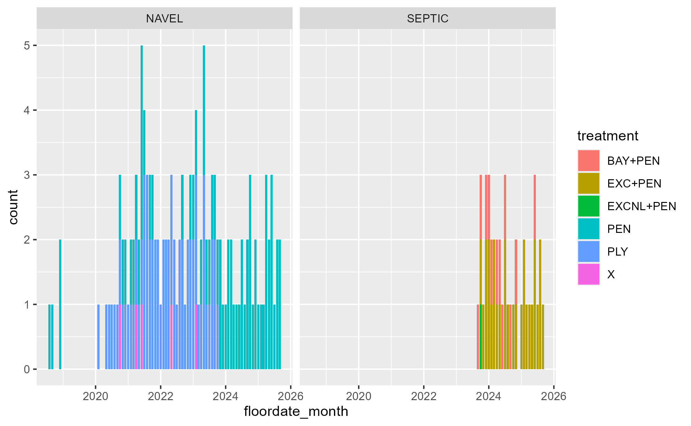
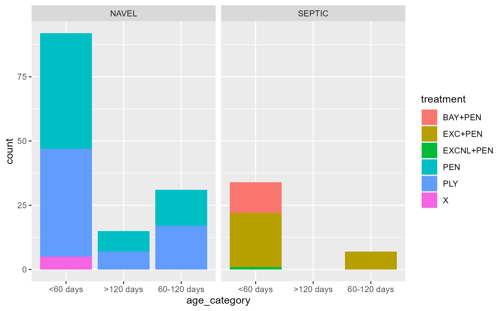

```{r}
#| label: setup
#| include: false
knitr::opts_chunk$set(echo = TRUE)

# This chunk is already finished for you, you don't need to modify anything here
library(tidyverse) #this includes many packages and is the main package used in nearly all data wrangling
library(arrow) #this package handles parquet files
library(skimr) #this is particularly helpful when looking at new data or finding NA values
library(waldo) #we use this to create answer keys for these exercises
library(RColorBrewer) #this makes the pretty colors 

solution_columns<-read_rds('data_milestones/solutions_week4_check_columns.rds')


#add some extra functions
source('../functions/fxn_add_event_counts.R')
source('data_milestones/fxn_floor_dates.R')


```

## Create and select columns

In this milestone, you'll write some of the code that was written for you in milestone 3.

1.  The events_formatted.parquet file is read in, named "events" in your environment, and filtered for health events. Filter this further so you only have only one or 2 unique health events. The example in the solution is based on 'NAVEL' and 'SEPTIC' events, but choose anything you want.
2.  create a new variable in events named **floordate_month**. The logic to create this variable is: **floor_date(date_event, 'months')**
3.  arrange the events by 3 variables: the animal (id_animal), the event (event), and then the event date (date_event).
4.  Pipe your events to the function fxn_add_event_counts(). This will add columns indicating the number of times the animal has had that event within the data set (event_count_animal) or within their lactation (event_count_lact). If you would like to see the code the creates these click on the function in your environment.
5.  create a new variable the is animal age in days at time of event. Name this variable "age_event"
6.  select all the variables below in the order you see them in the solution_columns table in your environment

```{r}
#| label: recreation-import
#| 
events<-read_parquet('../data/intermediate_files/events_formatted.parquet')%>%
  filter(event_type %in% 'health') %>% 
  filter(event %in% c("LAME")) %>% 
  mutate(floordate_month = floor_date(date_event, "month")) %>% 
  arrange(id_animal, event, date_event) %>% 
  fxn_add_event_counts() %>% 
  mutate(age_event = as.numeric(date_event-date_birth)) %>% 
  select(location_event, id_animal, id_animal_lact, id, date_birth, lact_number, lact_group, dim_event, age_event, floordate_month, event, remark, protocols, locate_lesion, event_type, date_event, event_count_lact, event_count_animal, Remark, remark_numbers1,remark_letters1, remark_remaining_after_numbers1, remark_remaining_after_letters1, remark_numbers2, remark_letters2, Protocols, protocols_numbers1, protocols_letters1, protocols_remaining_after_numbers1, protocols_remaining_after_letters1, protocols_numbers2, protocols_letters2) 
# 
# %>%
#   group_by(lact_group)
  


```

## Check selected columns

```{r}


waldo::compare(colnames(events), colnames(solution_columns))

```

### Step 2 - Disease and Treatments

Create 2 new variables for your events: Disease and Treatment. Use case_when() and whichever columns you would like to create the best description. Then use graphs, tables, or a combination to describe the timing your selected Disease(s), both over time and according to animal age or dim as appropriate. Show if there has been a change in the treatments used over time.

Below are a couple example graphics, but yours can be prettier.

```{r}
#| label: recreate-this
#| message: false



 

trim_events <- 
  events %>% 
  group_by(lact_group) %>% 
  mutate(trim_group = 
           case_when(event_count_lact == 1 ~ "1", 
                     event_count_lact >= 2 ~ "2+")) %>% 
   mutate(
    trim_need =
    case_when(protocols == "Trim Only" ~ "Routine", 
              protocols == "Abces\\Block" ~ "Abscess", 
              protocols == "Ulcer/Block" ~ "Ulcer",
              protocols == "Hairy Wart" ~ "Wart",
              protocols == "Foot Rot/Exce" ~ "Footrot"
            )) %>% 
  select(lact_group, dim_event, floordate_month, remark, protocols, locate_lesion, date_event, trim_need, event_count_lact, event_count_animal, trim_group) 

# %>% 
  # filter(trim_need != "Routine")
  
  
trim_events %>%
  ggplot(aes(x = dim_event, fill = trim_need)) +
  geom_histogram(bins = 10, color = "black") +
  facet_wrap(vars(trim_group),
             scale = "free_y",
     labeller = labeller(trim_group = c(
       "1" = "1 Trim",
       "2+" = "2+ Trims"
     ))) +
  labs(
    title = "DIM at Lame",
    x = "DIM at Lame (days)",
    y = "Count") +
  scale_fill_brewer(palette = "Set2")


```

### Extension Options

1)  Improve your description for your chosen events
2)  Choose a new disease
3)  choose to add multiple farms (either your own data or other example herds)

```{r}
# 
# trim_events %>% 
# count(event_count_lact, sort=TRUE) %>% 
#   slice_head(n=8) %>% 
#   pull(event_count_lact)
trim_events %>% 
  filter(protocols != "BLANK_UNKNOWN") %>% 
count(protocols, sort= TRUE)


```

```{r}

trim_events <- 
  events %>% 
  group_by(lact_group) %>% 
  mutate(trim_group = 
           case_when(event_count_lact == 1 ~ "1", 
                     event_count_lact == 2 ~ "2",
                     event_count_lact >= 3 ~ "3+")) %>% 
   mutate(
    trim_need =
    case_when(protocols == "Trim Only" ~ "Routine", 
              protocols == "Abces\\Block" ~ "Abscess", 
              protocols == "Ulcer/Block" ~ "Ulcer",
              protocols == "Hairy Wart" ~ "Wart",
              protocols == "Foot Rot/Exce" ~ "Footrot"
            )) %>% 
  select(lact_group, dim_event, floordate_month, remark, protocols, locate_lesion, date_event, trim_need, event_count_lact, event_count_animal, trim_group, event)  %>% 
  filter(trim_need != "Routine")
  ungroup() 

trim_events %>%
  ggplot(aes(x = dim_event, fill = trim_need)) +
  geom_histogram(bins = 10, color = "black") +
  facet_wrap(vars(trim_group),
             scale = "free_y",
     labeller = labeller(trim_group = c(
       "1" = "1 Trim",
       "2" = "2 Trims",
       "3+" = "3+ Trims"
     ))) +
  labs(
    title = "DIM at Lame",
    x = "DIM at Lame (days)",
    y = "Count") +
  scale_fill_brewer(palette = "Set3")

```

```{r}

events %>% 
  mutate(year_event = year(date_event)) %>% 
  filter(event == "LAME",
         lact_group != "Heifer",
         year_event == c(2021,2022,2023,2024,2025)) %>% 
  group_by(year_event, protocols) %>% 
  ggplot(aes(x = year_event, protocols, fill = lact_group, bins= 10)) +
  geom_tile() 
  # +
  # labs(
  #   title = "DIM at Lame",
  #   x = "DIM at Lame (days)",
  #   y = "Count") +
  # scale_fill_brewer(palette = "Set3")

## you can set categorical variables to re-order by a numeric variable inside the ggplot() - reorder = "variable" I think 

```

```{r}
#| label: heatmap_count, !!Mark's Graph!! 
# ==============================================================================
# Heat map of mastitis cases by treatment / year
# ==============================================================================

events %>%
  mutate(
    year_event = year(date_event)) %>% 
  filter(event == "MAST", 
         lact_group != "Heifer",
         event_count_animal == 1,
         year_event %in% c(2023, 2024, 2025)) %>%
  group_by(year_event, protocols) %>%
  summarise(case_count = n(), .groups = "drop") %>%   # count cases
  group_by(year_event) %>% 
  mutate(pct_cases = case_count / sum(case_count, na.rm = TRUE) * 100) %>%  # percentage of cases
  ungroup() %>%
  ggplot(aes(x = factor(year_event), y = protocols, fill = pct_cases)) +
  geom_tile(alpha = 0.7, color = "black") +
  geom_text(aes(label = case_count),   # show raw counts in each cell
            color = "black", size = 4) +
  scale_fill_distiller(palette = "YlOrRd", direction = 1) +   # Provides the heat mapping fill
  labs(
    x = "Year",
    y = "Treatment Protocols",
    fill = "Case Count",
    title = "Number of Cases by Year and Protocol",
    caption = "Filtered: MAST events, non-Heifers, 1st cases, years 2023–2025"
  ) +
  theme_minimal() +
  theme(plot.title = element_text(hjust = 0.5))
```

